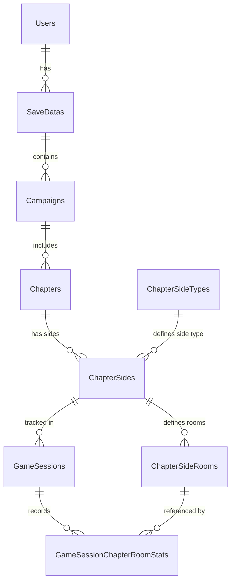

# TheCelesteTracker Database Schema (Full Reference)

Relational model for high-granularity tracking of Celeste gameplay statistics.
**Location:** `Saves/TheCelesteTracker.db` (SQLite)

---

## Writing Intentions

The database is designed to provide:
1.  **High Granularity:** Room-by-room statistics (deaths, dashes, jumps) for every gameplay session.
2.  **Campaign Isolation:** Separation of stats between Vanilla Celeste and various Modded LevelSets (e.g., Strawberry Jam, Spring Collab).
3.  **Cross-Save Analytics:** Ability to aggregate progress across different save slots and users.
4.  **Session-Based Tracking:** Distinction between a "Chapter Playthrough" (Session) and persistent "Save Data" stats.
5.  **Golden Berry Analysis:** Specific flags for tracking Golden Berry attempts and completions.

---

## Entity Relationships

The schema follows a strict hierarchical tree from the user down to individual room statistics.



### Hierarchy Breakdown:
1.  **Global Level:** `Users` -> `SaveDatas`. One system user can have multiple Celeste save slots.
2.  **Campaign Level:** `SaveDatas` -> `Campaigns`. Each save slot tracks multiple "Campaigns" (LevelSets like Vanilla, SJ, etc.).
3.  **Chapter Level:** `Campaigns` -> `Chapters`. Each campaign contains its unique set of chapters.
4.  **Structure Level:** `Chapters` acts as a parent for `ChapterSides` (SIDEA/SIDEB/SIDEC).
5.  **Room Level:** `ChapterSides` defines `ChapterSideRooms` (static room definitions per side).
6.  **Activity Level:** `ChapterSides` -> `GameSessions`. Every time you enter a level, a session is created for that specific side.
7.  **Granular Level:** `GameSessions` -> `GameSessionChapterRoomStats`. Per-room performance is logged within the context of a session.

## Event-Driven Management

The database is managed through specific Everest/Celeste hooks that trigger record creation or updates based on in-game actions.

### 1. Initialization Hooks (Context Setup)
Triggered when a chapter is entered from the Map or a Save Slot is loaded.
- **Hook:** `On.Celeste.SaveData.StartSession`
- **Action:** Calls `DB.Session_EnsureInDB`.
- **Managed Tables:** 
    - `Users`: Verified/Created once per mod lifecycle.
    - `SaveDatas`: Synced with current slot.
    - `Campaigns`: Creates entry for current LevelSet.
    - `Chapters`: Generates the composite SID.
    - `ChapterSides`: Upserts available berries and current progress.

### 2. Room Transitions (Metadata Collection)
Triggered when entering a new room.
- **Hook:** `On.Celeste.Level.LoadLevel`
- **Action:** Logs entry into a new room and initializes its entry in `ChapterSideRooms` (if missing).
- **Managed Tables:** `ChapterSideRooms`, `GameSessionChapterRoomStats` (in-memory initialization).

### 3. Gameplay Activity (Live Increments)
These hooks update the **current active session** in memory, which is later flushed to the DB.
- **Player Death (`On.Celeste.Player.Die`):** Increments `deaths_in_room`.
- **Jump (`On.Celeste.Player.Jump`):** Increments `jumps_in_room`.
- **Dash (`On.Celeste.Player.DashBegin`):** Increments `dashes_in_room`.
- **Strawberry Grab (`On.Celeste.Strawberry.OnPlayer`):** Sets `is_goldenberry_attempt` if golden.
- **Strawberry Collect (`On.Celeste.Strawberry.OnCollect`):** 
    - Increments `strawberries_achieved_in_room`.
    - Increments `berries_collected` in `ChapterSides` (Persistent sync).
    - Sets `is_goldenberry_completed` if golden.
- **Heart Collect (`On.Celeste.HeartGem.Collect`):**
    - Increments `hearts_achieved_in_room`.
    - Sets `heart_collected` to 1 in `ChapterSides`.
- **Chapter Completion (`On.Celeste.Level.RegisterAreaComplete`):**
    - Broadcasts `ChapterCompleted` event.

### 4. Session Finalization (Persistence)
Triggered when leaving a level or closing the game.
- **Hooks:** `On.Celeste.Level.End`, `Everest.Events.Celeste.OnShutdown`.
- **Action:** Flushes the entire `GameSession` DTO to the database in a single transaction.
- **Managed Tables:**
    - `GameSessions`: Final duration and golden status recorded.
    - `GameSessionChapterRoomStats`: All accumulated room stats are inserted.

---

## ID Shapes and String Formats

### Campaign Name ID
Represents the "LevelSet" in Everest.
- **Vanilla:** `Celeste`
- **Mods:** The internal name of the LevelSet (e.g., `StrawberryJam2023/1-Beginner`, `SpringCollab2020/2-Intermediate`).

### Chapter SID (Database Primary Key)
To ensure uniqueness across multiple save slots and campaigns, the database uses a composite-like string:
- **Format:** `{CampaignTableID}:{InternalSID}`
- **Example:** `1:Celeste/1-ForsakenCity`
- **Note:** `CampaignTableID` is the integer primary key from the `Campaigns` table.

### Side ID
Represents the difficulty mode of the chapter.
- **Values:** `SIDEA`, `SIDEB`, `SIDEC`
- **Source:** Generated via `AreaMode.ToStringId()`.

---

## Tables

### `Users`
| Column | Type | Notes |
| :--- | :--- | :--- |
| `id` | INTEGER | PRIMARY KEY, AUTOINCREMENT |
| `name` | TEXT | UNIQUE, NOT NULL |

### `ChapterSideTypes`
Lookup table for side identifiers.
| Column | Type | Notes |
| :--- | :--- | :--- |
| `id` | CHAR(5) | PRIMARY KEY (`SIDEA`, `SIDEB`, `SIDEC`) |

### `SaveDatas`
Links statistics to specific Celeste save slots.
| Column | Type | Notes |
| :--- | :--- | :--- |
| `id` | INTEGER | PRIMARY KEY, AUTOINCREMENT |
| `user_id` | INTEGER | FOREIGN KEY (`Users.id`) |
| `slot_number` | INTEGER | Save slot (0, 1, 2, ...) |
| `file_name` | TEXT | Name of the save file (e.g., "Madeline") |

### `Campaigns`
Tracks vanilla Celeste and mods separately per save file.
| Column | Type | Notes |
| :--- | :--- | :--- |
| `id` | INTEGER | PRIMARY KEY, AUTOINCREMENT |
| `save_data_id` | INTEGER | FOREIGN KEY (`SaveDatas.id`) |
| `campaign_name_id` | TEXT | LevelSet ID (e.g., "Celeste", "StrawberryJam2023") |

### `Chapters`
Individual levels within a campaign.
| Column | Type | Notes |
| :--- | :--- | :--- |
| `sid` | TEXT | **PRIMARY KEY**. Format: `{campaign_id}:{internal_sid}` |
| `campaign_id` | INTEGER | FOREIGN KEY (`Campaigns.id`) |
| `name` | TEXT | Display name |

### `ChapterSides`
Tracks progress and berry counts for A, B, and C sides.
| Column | Type | Notes |
| :--- | :--- | :--- |
| `chapter_sid` | TEXT | **PRIMARY KEY (Part 1)**, FOREIGN KEY (`Chapters.sid`) |
| `side_id` | TEXT | **PRIMARY KEY (Part 2)**, FOREIGN KEY (`ChapterSideTypes.id`) |
| `berries_available` | INTEGER | Total strawberries in this side |
| `berries_collected` | INTEGER | Strawberries collected so far (Synced with SaveData) |
| `heart_collected` | INTEGER | 1 if heart collected, else 0 |
| `goldenstrawberry_achieved` | INTEGER | 1 if golden berry collected, else 0 |
| `goldenwingstrawberry_achieved` | INTEGER | 1 if dashless golden berry collected, else 0 |

### `ChapterSideRooms`
Metadata for rooms within a chapter side.
| Column | Type | Notes |
| :--- | :--- | :--- |
| `chapter_sid` | TEXT | **PRIMARY KEY (Part 1)**, FOREIGN KEY (`ChapterSides.chapter_sid`) |
| `side_id` | TEXT | **PRIMARY KEY (Part 2)**, FOREIGN KEY (`ChapterSides.side_id`) |
| `name` | TEXT | **PRIMARY KEY (Part 3)**, Room ID (e.g., "a-00", "01-entry") |
| `order` | INTEGER | Room order in the MapData |
| `strawberries_available`| INTEGER | Number of berries inside this specific room |

### `GameSessions`
A single play session of a chapter side.
| Column | Type | Notes |
| :--- | :--- | :--- |
| `id` | TEXT | **PRIMARY KEY** (GUID). Unique session identifier. |
| `chapter_sid` | TEXT | FOREIGN KEY (`ChapterSides.chapter_sid`) |
| `side_id` | TEXT | FOREIGN KEY (`ChapterSides.side_id`) |
| `date_time_start` | TEXT | ISO8601 start timestamp |
| `duration_ms` | INTEGER | Total time spent in milliseconds |
| `is_goldenberry_attempt`| INTEGER | 1 if carrying a golden berry, else 0 |
| `is_goldenberry_completed`| INTEGER | 1 if completed with golden berry, else 0 |

### `GameSessionChapterRoomStats`
Granular per-room stats recorded during a session.
| Column | Type | Notes |
| :--- | :--- | :--- |
| `id` | INTEGER | PRIMARY KEY, AUTOINCREMENT |
| `gamesession_id` | TEXT | FOREIGN KEY (`GameSessions.id`) |
| `chapter_sid` | TEXT | FOREIGN KEY (`ChapterSideRooms.chapter_sid`) |
| `side_id` | TEXT | FOREIGN KEY (`ChapterSideRooms.side_id`) |
| `room_name` | TEXT | FOREIGN KEY (`ChapterSideRooms.name`) |
| `deaths_in_room` | INTEGER | Death count in this room |
| `dashes_in_room` | INTEGER | Dash count in this room |
| `jumps_in_room` | INTEGER | Jump count in this room |
| `strawberries_achieved_in_room`| INTEGER | Berries collected in this room during this session |
| `hearts_achieved_in_room`| INTEGER | Hearts collected in this room during this session |

---

## Common Queries

### 1. Total Playtime (Across all campaigns and saves)
```sql
SELECT 
    SUM(duration_ms) / 1000 / 60 / 60 AS total_hours 
FROM GameSessions;
```

### 2. Time Breakdown: Vanilla vs Modded
```sql
SELECT 
    c.campaign_name_id, 
    SUM(gs.duration_ms) / 1000 / 60 AS total_minutes
FROM Campaigns c
JOIN Chapters ch ON c.id = ch.campaign_id
JOIN GameSessions gs ON ch.sid = gs.chapter_sid
GROUP BY c.campaign_name_id;
```

### 3. All Strawberries Collected in A-Sides
```sql
SELECT 
    chapter_sid, 
    berries_collected, 
    berries_available
FROM ChapterSides
WHERE side_id = 'SIDEA';
```

### 4. Room-by-Room Death Leaderboard
```sql
SELECT 
    room_name, 
    SUM(deaths_in_room) as total_deaths
FROM GameSessionChapterRoomStats
GROUP BY room_name
ORDER BY total_deaths DESC
LIMIT 10;
```

### 5. Golden Berry Completion Rate
```sql
SELECT 
    COUNT(*) as total_attempts,
    SUM(is_goldenberry_completed) as successful_completions
FROM GameSessions
WHERE is_goldenberry_attempt = 1;
```

### 6. Heart Completion Progress
```sql
SELECT 
    chapter_sid, 
    side_id, 
    heart_collected
FROM ChapterSides
WHERE heart_collected = 1;
```

