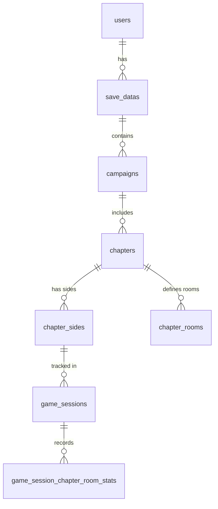

# TheCelesteTracker Database Schema (Full Reference)

Relational model for high-granularity tracking of Celeste gameplay statistics.
**Location:** `Saves/TheCelesteTracker.db` (SQLite)

---

## Writing Intentions

The database is designed to provide:
1.  **High Granularity:** Room-by-room statistics (deaths, dashes, jumps) for every gameplay session.
2.  **Campaign Isolation:** Separation of stats between Vanilla Celeste and various Modded LevelSets (e.g., Strawberry Jam, Spring Collab).
3.  **Cross-Save Analytics:** Ability to aggregate progress across different save slots and users.
4.  **Session-Based Tracking:** Distinction between a "Chapter Playthrough" (Session) and persistent "Save Data" stats.
5.  **Golden Berry Analysis:** Specific flags for tracking Golden Berry attempts and completions.

---

## Entity Relationships

The schema follows a strict hierarchical tree from the user down to individual room statistics.



### Hierarchy Breakdown:
1.  **Global Level:** `users` -> `save_datas`. One system user can have multiple Celeste save slots.
2.  **Campaign Level:** `save_datas` -> `campaigns`. Each save slot tracks multiple "Campaigns" (LevelSets like Vanilla, SJ, etc.).
3.  **Chapter Level:** `campaigns` -> `chapters`. Each campaign contains its unique set of chapters.
4.  **Structure Level:** `chapters` acts as a parent for `chapter_sides` (A/B/C) and `chapter_rooms` (static room definitions).
5.  **Activity Level:** `chapter_sides` -> `game_sessions`. Every time you enter a level, a session is created.
6.  **Granular Level:** `game_sessions` -> `game_session_chapter_room_stats`. Per-room performance is logged within the context of a session.

## Event-Driven Management

The database is managed through specific Everest/Celeste hooks that trigger record creation or updates based on in-game actions.

### 1. Initialization Hooks (Context Setup)
Triggered when a chapter is entered from the Map or a Save Slot is loaded.
- **Hook:** `On.Celeste.SaveData.StartSession`
- **Action:** Calls `DB.Session_EnsureInDB`.
- **Managed Tables:** 
    - `users`: Verified/Created once per mod lifecycle.
    - `save_datas`: Synced with current slot.
    - `campaigns`: Creates entry for current LevelSet.
    - `chapters`: Generates the composite SID.
    - `chapter_sides`: Upserts available berries and current progress.

### 2. Room Transitions (Metadata Collection)
Triggered when entering a new room.
- **Hook:** `On.Celeste.Level.LoadLevel`
- **Action:** Logs entry into a new room and initializes its entry in `chapter_rooms` (if missing).
- **Managed Tables:** `chapter_rooms`, `game_session_chapter_room_stats` (in-memory initialization).

### 3. Gameplay Activity (Live Increments)
These hooks update the **current active session** in memory, which is later flushed to the DB.
- **Player Death (`On.Celeste.Player.Die`):** Increments `deaths_in_room`.
- **Jump (`On.Celeste.Player.Jump`):** Increments `jumps_in_room`.
- **Dash (`On.Celeste.Player.DashBegin`):** Increments `dashes_in_room`.
- **Strawberry Grab (`On.Celeste.Strawberry.OnPlayer`):** Sets `is_goldenberry_attempt` if golden.
- **Strawberry Collect (`On.Celeste.Strawberry.OnCollect`):** 
    - Increments `strawberries_achieved_in_room`.
    - Increments `berries_collected` in `chapter_sides` (Persistent sync).
    - Sets `is_goldenberry_completed` if golden.

### 4. Session Finalization (Persistence)
Triggered when leaving a level or closing the game.
- **Hooks:** `On.Celeste.Level.End`, `Everest.Events.Celeste.OnShutdown`.
- **Action:** Flushes the entire `GameSession` DTO to the database in a single transaction.
- **Managed Tables:**
    - `game_sessions`: Final duration and golden status recorded.
    - `game_session_chapter_room_stats`: All accumulated room stats are inserted.

---

## ID Shapes and String Formats

### Campaign Name ID
Represents the "LevelSet" in Everest.
- **Vanilla:** `Celeste`
- **Mods:** The internal name of the LevelSet (e.g., `StrawberryJam2023/1-Beginner`, `SpringCollab2020/2-Intermediate`).

### Chapter SID (Database Primary Key)
To ensure uniqueness across multiple save slots and campaigns, the database uses a composite-like string:
- **Format:** `{CampaignTableID}:{InternalSID}`
- **Example:** `1:Celeste/1-ForsakenCity`
- **Note:** `CampaignTableID` is the integer primary key from the `campaigns` table.

### Side ID
Represents the difficulty mode of the chapter.
- **Values:** `SIDEA`, `SIDEB`, `SIDEC`
- **Source:** Generated via `AreaMode.ToStringId()`.

---

## Tables

### `users`
| Column | Type | Notes |
| :--- | :--- | :--- |
| `id` | INTEGER | PRIMARY KEY, AUTOINCREMENT |
| `name` | TEXT | UNIQUE, defaults to System Username |

### `save_datas`
Links statistics to specific Celeste save slots.
| Column | Type | Notes |
| :--- | :--- | :--- |
| `id` | INTEGER | PRIMARY KEY, AUTOINCREMENT |
| `user_id` | INTEGER | FOREIGN KEY (`users.id`) |
| `slot_number` | INTEGER | Save slot (0, 1, 2, ...) |
| `file_name` | TEXT | Name of the save file (e.g., "Madeline") |

### `campaigns`
Tracks vanilla Celeste and mods separately per save file.
| Column | Type | Notes |
| :--- | :--- | :--- |
| `id` | INTEGER | PRIMARY KEY, AUTOINCREMENT |
| `save_data_id` | INTEGER | FOREIGN KEY (`save_datas.id`) |
| `campaign_name_id` | TEXT | LevelSet ID (e.g., "Celeste", "StrawberryJam2023") |

### `chapters`
Individual levels within a campaign.
| Column | Type | Notes |
| :--- | :--- | :--- |
| `sid` | TEXT | **PRIMARY KEY**. Format: `{campaign_id}:{internal_sid}` |
| `campaign_id` | INTEGER | FOREIGN KEY (`campaigns.id`) |
| `name` | TEXT | Display name (Optional) |

### `chapter_sides`
Tracks progress and berry counts for A, B, and C sides.
| Column | Type | Notes |
| :--- | :--- | :--- |
| `id` | INTEGER | PRIMARY KEY, AUTOINCREMENT |
| `chapter_sid` | TEXT | FOREIGN KEY (`chapters.sid`) |
| `side_id` | TEXT | "A", "B", or "C" |
| `berries_available` | INTEGER | Total strawberries in this side |
| `berries_collected` | INTEGER | Strawberries collected so far (Synced with SaveData) |

### `chapter_rooms`
Metadata for rooms within a chapter.
| Column | Type | Notes |
| :--- | :--- | :--- |
| `chapter_sid` | TEXT | PRIMARY KEY (Part 1), FOREIGN KEY (`chapters.sid`) |
| `name` | TEXT | PRIMARY KEY (Part 2), Room ID (e.g., "a-00", "01-entry") |
| `order` | INTEGER | Room order in the MapData |
| `strawberries_available`| INTEGER | Number of berries inside this specific room |

### `game_sessions`
A single play session of a chapter side.
| Column | Type | Notes |
| :--- | :--- | :--- |
| `id` | TEXT | **PRIMARY KEY** (GUID). Unique session identifier. |
| `chapter_side_id` | INTEGER | FOREIGN KEY (`chapter_sides.id`) |
| `date_time_start` | TEXT | ISO8601 start timestamp |
| `duration_ms` | INTEGER | Total time spent in milliseconds |
| `is_goldenberry_attempt`| INTEGER | 1 if carrying a golden berry, else 0 |
| `is_goldenberry_completed`| INTEGER | 1 if completed with golden berry, else 0 |

### `game_session_chapter_room_stats`
Granular per-room stats recorded during a session.
| Column | Type | Notes |
| :--- | :--- | :--- |
| `id` | INTEGER | PRIMARY KEY, AUTOINCREMENT |
| `gamesession_id` | TEXT | FOREIGN KEY (`game_sessions.id`) |
| `room_name` | TEXT | ID of the room |
| `visited_order` | INTEGER | Sequence in which rooms were visited |
| `deaths_in_room` | INTEGER | Death count in this room |
| `dashes_in_room` | INTEGER | Dash count in this room |
| `jumps_in_room` | INTEGER | Jump count in this room |
| `strawberries_achieved_in_room`| INTEGER | Berries collected in this room during this session |
| `hearts_achieved_in_room`| INTEGER | Hearts collected in this room during this session |

---

## Common Queries

### 1. Total Playtime (Across all campaigns and saves)
```sql
SELECT 
    SUM(duration_ms) / 1000 / 60 / 60 AS total_hours 
FROM game_sessions;
```

### 2. Time Breakdown: Vanilla vs Modded
```sql
SELECT 
    c.campaign_name_id, 
    SUM(gs.duration_ms) / 1000 / 60 AS total_minutes
FROM campaigns c
JOIN chapters ch ON c.id = ch.campaign_id
JOIN chapter_sides cs ON ch.sid = cs.chapter_sid
JOIN game_sessions gs ON cs.id = gs.chapter_side_id
GROUP BY c.campaign_name_id;
```

### 3. All Strawberries Collected in A-Sides
```sql
SELECT 
    ch.sid, 
    cs.berries_collected, 
    cs.berries_available
FROM chapter_sides cs
JOIN chapters ch ON cs.chapter_sid = ch.sid
WHERE cs.side_id = 'A';
```

### 4. Room-by-Room Death Leaderboard
```sql
SELECT 
    room_name, 
    SUM(deaths_in_room) as total_deaths
FROM game_session_chapter_room_stats
GROUP BY room_name
ORDER BY total_deaths DESC
LIMIT 10;
```

### 5. Golden Berry Completion Rate
```sql
SELECT 
    COUNT(*) as total_attempts,
    SUM(is_goldenberry_completed) as successful_completions
FROM game_sessions
WHERE is_goldenberry_attempt = 1;
```
